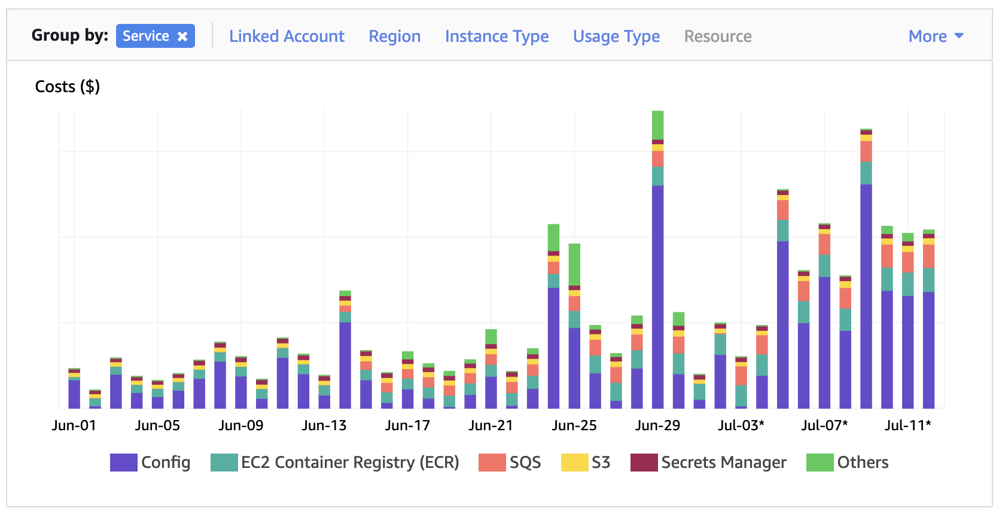

If you have used AWS you know how costs can sneak up on you. I have experience getting a heart stopping bill at a previous startup. With Cyclic I've decided I want to start adding controls and alerts from the start.

I recently found that AWS added Cloud Formation support for Budgets ([AWS::Budgets::Budget](https://docs.aws.amazon.com/AWSCloudFormation/latest/UserGuide/aws-resource-budgets-budget.html)). You can create a quick budget to to notify you of either actual COST limits or FORECASTED cost limits. Here is a sample Cloud Formation example.

‍<!-- truncate -->

I have also been working on setting up [spike.sh](https://spike.sh) to use for an incident management and alerting platform. They accept SNS webhooks. So two Cloud Formation stacks later we can now get the budgets.amazonaws.com principal to publish alerts to an SNS topic that fires an https webhook at our spike.sh integration URL. This will trigger an incident and alerts.

‍

Launch a budget into your account:

‍

Of course it wouldn't be AWS without a few sharp edges. So here are the caveats:

*   We are publishing the "Launch Stack" button templates on Github. However Cloud Formation only accepts s3 urls for template bodies
*   We are creating the S3 bucket to host the templates with Cloud Formation. However despite Requestor Pays being 7 years old there is no Cloud Formation support. Funny how Cfn requires S3 but then makes it hard to use Cfn to setup hosting of the templates ([github issue](https://github.com/aws-cloudformation/cloudformation-coverage-roadmap/issues/123))
*   SNS topic policies only allows named service principals eg: 'budgets.amazonaws.com' for some reason '\*' is invalid.

‍

All code can be found in this github repository ([cyclic-software/budget-sns-alerts](https://github.com/cyclic-software/budget-sns-alerts))

‍

Let us know what you think and if you find this helpful.
