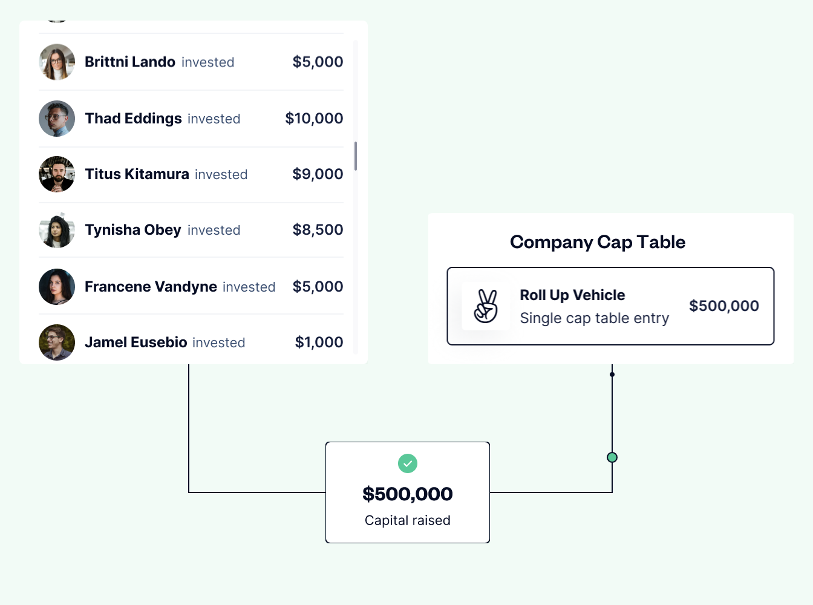

I recently raised a friends and family round for Cyclic and used an AngelList Roll Up Vehicle (RUV). More on the round later. Multiple founder friends have asked about my experience and why I used an RUV. Here is the Why, What and How:

<!-- truncate -->

**TL;DR**
=========

  

> A Roll Up Vehicle is a legal entity that can take investments from multiple investors or entities and then invest that money as a single entity on your company’s cap table. Here are the pros and cons for using an AngelList RUV as part of a venture capital fundraising round:

‍  

Visual depiction of how investments are rolled up onto your captable

**Pros**:
---------

*   Future rounds are simplified, exactly when most stressful
*   Future rounds are cheaper ($)
*   Investor's address and info is kept private
*   Simplified e-signature and funding for investors and company at time of investment

###   

**Cons**:
---------

*   Some additional setup for the company (~1hr)
*   Small additional cost (now only filing fees https://www.angellist.com/blog/eliminating-fees-for-roll-up-vehicles)
*   Additional complexity describing to your investor who AngelList is and how they are involved

  
  

### **Should I use a RUV?**

  

I would definitely recommend an AngelList RUV to anyone raising an early venture capital round where:

  

*   You expect to raise another round in the future 

  

And one or more of these to apply:

  

*   You have 10 or more angels
*   You have angels that do less than 4 deals a year
*   You have angels writing checks for less than $25k

  
  

### **Cyclic - What we do**

  

As a developer the complexity to go from your local to the cloud is increasing. This is driving cloud platform selection into a pre-design time decision. We are dedicated to solving both of these problems for developers. Our goal is to let you push to deploy while making cloud environment selection a runtime decision.
‍
<!--  -->

### **My Past Experience**

At the last company I co-founded, we raised a convertible note and then two priced rounds over the course of 7 years. The deal terms were reasonably standard for VC deals. They included drag along provisions. We were first time founders and I think we did an "ok" job of keeping all of our investors updated on how the company was doing.

Despite drag along rights (i.e. company able to "drag" small investors into a transaction if some percentage of shares in the company agree to the transaction), the lawyers involved with our second priced round wanted signed docs from all investors along with consent of spouse docs for any investment held by a person instead of trust or other entity. This meant that we needed to coordinate outreach to roughly ten angel investors, most of whom were non-professional angels. We needed to bring them up to speed on why we were raising, and explain we needed their signatures on documents for the round even though the company had drag along rights. Oh and by the way, we needed signatures from their spouses as well, leading them to have the same conversation with less fidelity with their spouse.

  

The more experienced angels who had larger checks generally understood the process and were more likely to have entities which they used to make the original investment. So they were either less likely to have questions and most were able to be a sole signer on behalf of the entity that held the investment. The converse of this was also true. The smaller check angels were more likely to have questions, they were less familiar with what was standard and they were more likely to need signatures from a spouse. Additionally, it seemed that the less experienced angels were less engaged with email and had longer turn around times.

  

In a vacuum, handling  each of these conversations is manageable. However, once a closing date was set,  all of these small "punch list" items seemed to bubble to the surface. It seemed that there was a spike in the length of items remaining once the date was set. The 7 to 14 days before closing are among the most stressful for a co-founder. In my experience, having extra tasks and communication on my plate was extra stress at exactly the wrong time.

  

> The 7 to 14 days before closing are among the most stressful for a co-founder... having extra tasks and communication on my plate was extra stress at exactly the wrong time.

  

### **Why an RUV**

  

The RUV prevents the need to keep going back to the early angels. It is a legal structure where the angels have already agreed that someone designed by the RUV organizer will be able to sign future docs related to their investment. The designated person can sign any future fundraising documents. In my case, I am that designated signer.

  

This means at the next funding round I will be able to sign on behalf of the RUV. So for a bit more time and cost upfront (and maybe a bit more complex conversation with the angels) I am able to decrease my complexity (and stress) at the time of each future funding round.

  
  

### **How it works for Founders**

  

Sign up and on-boarding were easy. I wrote a blurb on the company, uploaded a deck or memo, filled in some deal terms, identified notable co/lead-investors, targeted raise amount, and selected how I would pay the RUV fee (either company pays or investors pay). I didn’t have the exact form of the SAFE complete when I set up the RUV, it is only required at close, provided it is substantially the same terms as any of the listed co/lead investors.

  

For me there was some email back and forth with the AngelList team since they were still doing a staged rollout when I signed up. I had some questions during setup and emailed with two people who work at AngelList. Both were responsive and helpful. The email support felt personal and attentive.

  

My only complaints on the company product side are that the UI/UX was a bit complicated for just doing the RUV. It seemed it was more focused on syndicates and funds. If there is any "product" work for the AngelList team this is probably where it is. For example: to get to the RUV page you navigate via the "Deals" menu item and the deal is listed under my "Syndicate". This all sorta makes sense given the product is essentially a Syndicate where the fee and carry are 0%. However it doesn’t really make sense when I am the company founder doing a RUV. Additionally I didn’t find a way to set a per investor minimum, perhaps I just missed it in interface. These are minor points of friction but they left me with a feeling that it was still an early product that wasn’t fully polished yet.

  
  

### **How it works for Investors**

  

The investor side was smooth even for first time angels investing either personally or through an entity. The flow has e-signature to the RUV docs and the ability to enter bank account details so AngelList can initiate an ACH (electronic transfer). There is also the ability for the investors to wire if that is their preference.

  

That is literally it. Smooth and easy.  
  
  

### Thoughts? Questions?  

‍

Let me know what you think. Did you find this helpful? Do you still have questions?

‍

You can: [Signup for Cyclic](https://app.cyclic.sh/api/login)

‍

Shoot me an email: kam.lasater@cyclic.sh

‍

Give me a shout out on twitter: https://twitter.com/seekayel
