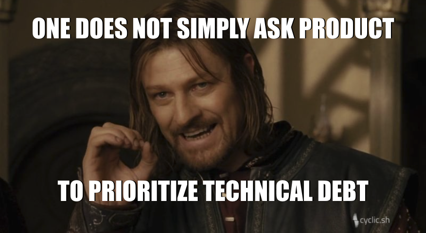

Does this sound familar?

**Techie**: We are drowning in technical debt!  

**Business person**: Oh really! What is it costing us?  

**Techie**: Oh, it’s not that. What I’m saying is the code doesn’t use best practices, there are alot of things hard coded and lots of spaghetti code. It makes the code really brittle.  

**Business person**: But can we still deliver what we promised to Big Co Inc?  

**Techie**: Yes, but we will have to do some workarounds. Working on the system is painful and what could have been a one day job will instead take a week. We really need to refactor!

**Business person**: Ah. That's good news. Our number one priority right now is Big Co Inc.

**Conclusion**: You don’t like your job because it is hard and/or annoying. I will tell your dev manager to ask you to work on the weekend.

<!-- truncate -->

### Talking with Business Leaders

  

When we use the term technical debt with non-technical business colleagues, they assume, that technical debt is analogous to financial debt. After a few minutes of discussion they are usually relieved to find that there is no actual money problem. Then after not seeing any tangible sign of a fire in the movie theater, they will then conclude that that we either don’t know what we are talking about or we are using the wrong terms or both.  Think about their context, how quickly would the CFO get fired if they claimed "we have a lot of debt" but couldn’t produce a balance sheet with lenders, amounts, interest rates and terms?

  
:::warning[Do you have an inventory?]

How quickly would the CFO get fired if they claimed "we have a lot of debt" but couldn’t produce a balance sheet?

:::

In this unprepared conversation we miss a great opportunity to convince that business leader of a course of action we are proposing or to engage in a productive trade-off discussion about risk, investment and priorities. Instead we reinforce the business leader’s view that we may know about software but we don’t know about business, and that we shouldn’t be making decisions about priority. 

:::danger

Just as someone who uses technical jargon incorrectly can lose credibility with enginners, if we use business language incorrectly we lose credibilty with the business leaders we are trying to persuade.

:::

In this staged conversation, what we communicated was that technical debt made our job hard and annoying. Notice it did not communicate: an inventory of debt, the ongoing cost to the business and the investment needed to pay it off.

  

### How to Fix It

Companies and business leaders don’t care if jobs are hard or annoying or take longer than they "should". The difference between a user story taking a day or 3 days is negligible compared to its business value. Companies and their leaders care about revenue and costs. They care about customers and growth. They care about time to market. If we want to have our non-technical colleagues listen and act, we need to either improve our use of the financial terms they understand or we need to translate our message into business outcomes that they do care about.

:::tip[How to be heard]

We need to translate our message into business outcomes that business leaders do care about.

:::

To capture these opportunities we need to go back to the beginning. The only way to remedy these failures in communication is to refactor our language and use of terms. We need to better define technical debt and the terms we use to describe it. The use of units of dollars is a powerful tool to communicate to those not part of the software design, build, and run value stream. Let's start with how the non-technical listener will understand the terms of debt.

:::tip[Everyone Understands Dollars]

Using a unit of dollars is a powerful tool to communicate to those not part of building software. Convert the techinical debt discussion into a conversation about dollars. You may still disagree but you will then at least be talking about the same thing.

:::

### What is Financial Debt?

  

**Debt** is a contractual agreement that allows the **borrower** to to shift future **consumption** into the present. This also allows the **lender** to do the reverse, shift present consumption into the future. The amount of consumption that is shifted is the **principal**. The amount that is still due at any point of time is the **balance**. The cost per unit of shifted consumption is the **interest rate**. The distance through time that the consumption is shifted is the **term** of the debt. The frequency and amount that is paid to service the debt is the **payment schedule**. All of these terms should be familiar to most consumers who have a mortgage, credit cards or a car loan.

  

Notice that there is no judgment or statement if debt is good (**productive**) or bad (**unproductive**). If you use debt to purchase a house, is that good or bad? That question can only be answered in the context of the cost of that debt (**interest rate**) and if you are changing your monthly consumption on housing. If your mortgage payment is less than your current rent then it is probably good debt. By borrowing money you have lowered your monthly expenses. This is a productive use of debt.

  

This view of debt is much more inline with how companies reason about their debt. The primary questions are:

1. What is the cost of the debt?
2. What additional value will the debt buy?
3. What is the expected change to cash flow from this investment?

  

Borrowing money to build a bigger factory that will enable more efficient production of your products is probably a productive use of debt. Borrowing to fund bonuses for executives is probably unproductive.

  
  

### A Different Conversation

  

If we use these terms to communicate the technical debt we are holding as a team the communication could look like this.

  

**Techie**: Oof, we had to give discounts that amounted to 1% of our sales again last month.  

**Business person**: Yeah but what can we do about it?  

**Techie**: Well, our order system is filled with technical debt. We can either keep paying with the discounts for the failed orders, or we can invest in 3-6 weeks of engineering time to half the error rate. This could delay other features.  

**Business person**: If you can half the error rate we can afford to hire more engineers.
