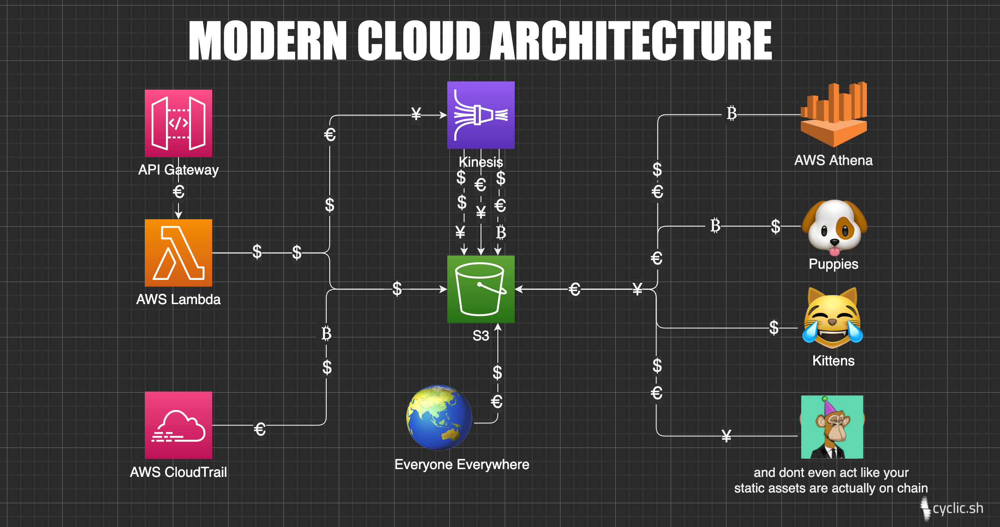
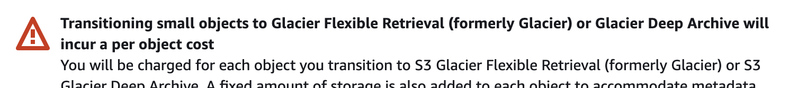

_(a short story inspired by true events)_

TLDR: Mere mortals implement best practices for S3 read and write performance, create a million billion s3 objects with their high performance system, try to clean up the really really expensive mess and find themselves in a _dimension as vast as space and as timeless as infinity._

<!-- truncate -->

In the days before BigQuery and S3's unlimited object storage, data was finite and predictable. The constraint drove engineers and architects to decide what they would and would not store at design time. Rigid data models and schemas were put in place. The data at rest was kept safe from developers behind dedicated teams with God mode SQL permissions.  


### Today managed services have delivered on their **_great promise_** .

Today managed services have delivered on their great promise. You can now grow your MVP to enterprise scale and all the things are taken care of for you.
‍

Now, AWS Kinesis can dump [half a million](https://docs.aws.amazon.com/firehose/latest/dev/limits.html) (soft limit) records per second into an S3 bucket. If you don't know where to find half a million of records per second, a handy menu of [channel partners](https://aws.amazon.com/eventbridge/integrations/) is available on the console. They are ready to pipe it to you with only a few clicks_. (But don’t worry, versioning is probably enabled on your bucket and some runaway recursive ghost code is endlessly touching some config file.)_

The NDJSON is flowing, data scientists are on-boarded and life is really great for a while, until one day; at one of the many many status meetings the leadership points out that your group has **burned through the cloud budget for the year, and it is only May**. In cost explorer, the trickle from multiple firehoses has accumulated into an S3 storage bill of almost $100k/month. 

> ... the trickle from multiple firehoses has accumulated into an **S3 storage bill of almost $100k/month**.

This **sounds like a disaster**, but it's not the end of the world, right? At least the problem is measurable. And after all, you can just delete a bunch of objects and move a bunch of the remaining junk to AWS Glacier (or whatever they just changed the name to).**‍**

### **Or can you?**

##### **‍**⚠️ Documentation References Ahead ⚠️

S3 objects are named by their Bucket and Prefix - For the S3 objects :

```
s3://my-bucket-us-east-2/app/events/login-123123.json  
s3://my-bucket-us-east-2/app/events/logout-436564.json
```

The json files named `login-123123.json` and `logout-436564.json` are not actually in a folder called events nested in another called app.

The files are stored on a physical drive somewhere and indexed someplace else by the entire string `app/events/` - called the prefix. The `/` character is really just a rendered delimiter. You can actually specify [whatever you want](https://docs.aws.amazon.com/AmazonS3/latest/userguide/using-prefixes.html) to be the delimiter for list/scan apis. 

Anyway, under the hood, these prefixes are used to shard and partition data in S3 buckets across whatever wires and metal boxes in physical data centers. Since any character can be a delimiter, this actually happens over time as AWS discovers the access patterns for the data. This is important because while AWS will adapt to any pattern - the prefix design drives access patterns for human developers and impacts performance in large scale high volume read and write applications.

The limits on reads and writes are:

* 3,500 PUT/COPY/POST/DELETE requests per second per prefix
* 5,500 GET/HEAD requests per second per prefix  

This means you can make up to 3500 write / 5500 read requests per second to add or look at `app/events/` files. Higher than that, and you may experience `503` or `429` errors, especially with burst traffic.  

When faced with the challenge of producing or accessing big data with practical performance - [Best practices](https://docs.aws.amazon.com/AmazonS3/latest/userguide/optimizing-performance.html), enterprise support, and your technical account manager (TAM) will recommend that you:

> ... use an object key naming pattern that distributes your objects across multiple prefixes.  

### Tech debt

These best practices are usually overlooked in early MVPs and objects are likely stored with the familiar `folder/file` pattern. It doesn't take long for the issue to expose itself. The first performance issues are usually experienced on read when someone first tries large scale queries with tools like AWS Athena and competes with the customer-facing processes for S3 reads.  

This is chalked up as a [repaying tech-debt](https://www.cyclic.sh/posts/we-sound-like-idiots-when-we-talk-about-technical-debt) and work is done to adapt the existing patterns to best practices. Processes that used to produce `app/events/login-123123.json` are refactored to write `app/events/dt=yyyy-mm-dd/login-123123.json` instead. (Actually something like app/events/dt=yyyy-mm-dd/asdfasdfasdf.gz , building crawler schema to make parquet out of messy, dynamic json files is hard and you think you're smart and just enable gzip compression in firehose.)

**Cool.** You configure the partition key `dt=yyyy-mm-dd` in the data catalog, write some documentation about how everyone should use date ranges to make queries efficient. All is well and the data science team can again do linear regressions aka "Machine Learning" to find out which events make the most money or, you know "drive business kpis".

### Back to our original problem

Some time has passed and **you now have a shitload of data in S3**. Someone has noticed how much it costs and **now you have to clean it up**.  

Hopefully, AWS is holding your hand on this one - you're a really great customer obviously. They will tell you, the two options you have to clean stuff up are:

* **Delete objects one by one** manually by using the list and delete API’s _(yeah, sounds dumb)_
* **Set up lifecycle policies** at the bucket level to expire objects based on prefix rules _(this sounds promising!!)_

Lifecycle policies are pretty great.

They work by first specifying a filter like:

* Apply by tag _(That would be sweet.. but no one tagged any of the objects that are already in there)_
* Apply by a size threshold _(There is no meaningful size difference between stuff you might want or not want)_
* Apply by prefix _(Yeeeah, that's the one)_

Then specifying a rule like:

* Expire after some time has passed
* Move to a different storage class
* Delete older versions of objects

### Stop the bleeding  

Without much research, the prefix filter thing looks really good. Naturally, as it is with filters, everyone would need to decide what they want to keep and not keep.  That sounds like a mess of calls and meetings. On that dilemma, the (actually good) advice from your partners at AWS

> "Your costs are accumulating, we can help you move the really old stuff to Glacier to stop the bleeding."  
> ‍- Some AWS bro

There are obvious tradeoffs with Glacier. But since large scale reads, especially ones on old data are not often done, after some short all-hands discussions everyone agrees.

### The 100 thousand dollar button  

You go back and press the button in the console. A message comes up asking you to confirm that you are aware that:



But isn't there like a million billion objects?? How about a different storage class?  [Requests & data retrievals](https://aws.amazon.com/s3/pricing/) > Lifecycle Transition requests into (per 1,000 requests). Even though the s3 console does not produce the ominous warning when selecting other storage classes, [transitional request charges apply](https://docs.aws.amazon.com/AmazonS3/latest/userguide/lifecycle-transition-general-considerations.html). **Fuuuuuuuuu  
‍**  
Doing metrics inventory with some help from AWS on your billions of json files and a little math - it is determined that **pressing this button will incur a one time cost of around $100,000**.

Very few people (all non-technical) in the organization have the ability to authorize this. No one (or at least not the mere mortals) wants to be the one to give those people this news. There goes Plan A. On to plan B: Figure out what can be deleted.
  
Before this gets escalated, you rush to set up meetings with stakeholders. Data science says keep all the logins but don’t care about logouts. The application team needs both but only for a week or so. Compliance says some things can be archived but archives must be kept for a year.  Complicated, but for now there is something to say at the status meetings - "We're working on it."  

> "We're working on it."
>
> \- everyone in every status meeting ever

### Lifecycle policies are not magic

Fast forward through three months of weekly status meetings, working with different teams to document data retention requirements. Yes, the bills were paid, more stuff has been stored and costs have risen, but - **there is finally a list!**

You will archive the logouts after 30 days and delete after a year for compliance, logins will be kept for 6 months for the data science team, archived... etc. etc.

‍

**Now here is the twist.** Somehow over many meetings, AWS support calls, etc - the story of how prefix filters work has morphed into how everyone wanted it to work.  Checking back in with support - you find out that `app/events/\*/login-\*.json` and `app/events/\*/logout-\*.json` is not actually going to magically scan wildcard patterns. It's the flip side of the partitioning coin. **The thing that makes reads and writes so performant makes it impossible to implement wildcards in lifecycle policies.**

How did everyone come to the misunderstanding? (well other than by not reading the docs) Could it be coming across [similar language in docs for a different AWS service](https://docs.aws.amazon.com/mediastore/latest/ug/policies-object-lifecycle-components.html) that does have wildcards? Skimming over [blog posts](http://www.deplication.net/2019/02/aws-tip-wildcard-characters-in-s3.html) on the subject? The [S3 docs](https://docs.aws.amazon.com/AmazonS3/latest/userguide/intro-lifecycle-rules.html) not telling you explicitly that you can't do that? _(Comments welcome)_  

### The Truth

Faced with this truth, the heroes realize that a lot of time has been put into crafting those rules, lists were made, arguments were had. There is no going back to Plan A now. A few sprints later - developer gets a user story: **Use big-ass SageMaker to crawl s3 and clean up** _(3 points._ 
  
Whether or not the org is still paying that bill has been lost to history but legend says that user story got de-prioritized.
