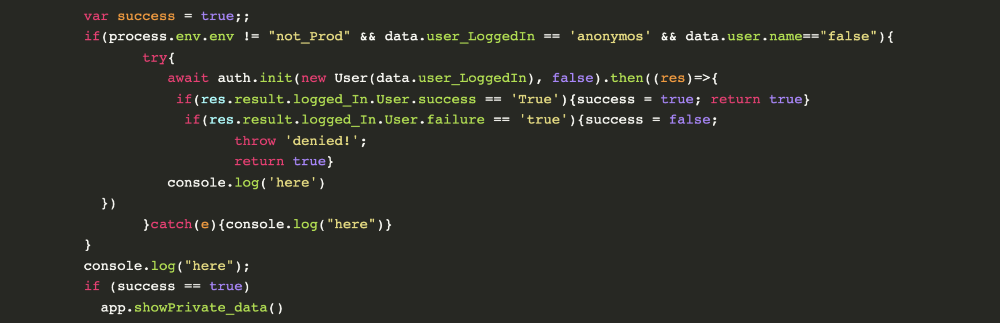

I know how to write good code.

Usually it means spending more time now to make the code better for some future state of the world. This assumes that I know what the future will look like. In software we rarely know what the future holds.

<!-- truncate -->

:::tip[Deep Thoughts]

In software we rarely know what the future holds.

:::

Uncertainty can be caused by:

*   Not knowing the technology
*   Not knowing the business
*   Not knowing the user
*   Not knowing the data size of the system
*   Not knowing the longevity of the code
*   Unknown-unknowns (see 2020 for more complete list of examples)

‍  

When I have uncertainty about the future, cycle time is most important. It allows me to capture value from my code by: learning as quickly as possible, minimizing impacts of bad or faulty code, as well as shortening my time to market.

  

Any friction hurts my cycle time. This decreases the rate I can turn uncertainty into certainty aka learning. My longest term value is created by learning as quickly as possible, since it is a multiplier for all future code I write or systems I design. Said another way: As "writing is re-writing" coding is refactoring.

:::tip[Where the Value Is]

My longest term value is created by learning as quickly as possible.

:::
‍  

Here is why you should write shitty code. Or more precisely, why you should write MORE shitty code.

‍

### Build the skill of writing code

If you want to learn how to write code the best way to develop that skill is practice. I have found I can read all I want, but I don’t retain the lesson until I type the code with my fingers. Coding is a skill that is not learned in a day. It is a way of thinking and approaching problems. It is a collection of knowledge about tools and computing environments. The only way to develop this knowledge is to use the tools and environments. Each time I write code the easier and less shitty the next time will be.

‍

:::tip[Self Improvement]

Each time I write code the easier and less shitty the next time will be.

:::
‍  

### Reconnect with the joy of creation

Writing shitty code means focusing on getting to the outcome as quickly as possible. This means getting to that feeling of success and satisfaction that something, anything is working. I wrote my first line of code about three decades ago, I still get a thrill each time I get a new piece of code working.
‍  

### Learn How Code - Also Systems Fail

Systems fail. I have found that these are the most precious opportunities to learn. My biggest learnings have come not from making some quality trade-off I anticipated, it was some behavior or input to the system that I never even considered. If I spend time building something that is “flawless” I am emotionally invested in it working. Then, when something goes wrong I look for errors external to the code I wrote.

When I write shitty code I have no emotional attachment to it functioning. When it fails I assume it is the weakest link and dive into learning more about the code and system. This mental state is a state of wonder and joy.

No code runs wholly in isolation. Each unexpected failure (by definition) is something that I didn’t understand. Therefore each failure is a perfectly crafted lesson that is adaptively constructed for me to maximize my learning.

### Learn how to debug

When I code I have several standard loops of feedback. When I write shitty code I turn up the frequency of those feedback loops. This naturally puts pressure on me to understand where to look and how to look for output from the code I am writing. Each time I write code I learn more about my tools. I could learn a new keyboard short-cut for my editor or I could write a script for some manual step in the testing process. The point is that each time I write code I improve the quality of my tools and my understanding of those tools.

### Explore the design space

If I am writing code to do something that I am unfamiliar with, which is basically all the code I write, because otherwise it would be refactoring, I don’t know the design space. I don’t know what is possible because I don’t know what I don’t know.

In drawing classes sometimes they assign variation studies. Basically you come up with 5 or 10 initial sketches from some prompt. Then you draw 5 or 10 variations of each. This is an exploration of the design space. Sometimes I find myself comparing two possible designs. This is a limitation on what is truly possible. There are more likely to be dozens of different possible designs. Writing more shitty code lets me see more of what is possible. I look up from where I stand and see the whole landscape of possibility.

:::tip[Explore]

Writing more shitty code lets me see more of what is possible.

:::

### Lowered expectations releases more creative energy

I know I mentioned this in previous reasons, however the change in emotional state I experience when I let go of the ego of my code being “right”, is monumental. Instead of feeling frustration or irritation I feel wonder, discovery, joy and a sense of accomplishment. Even if all the other reasons are wrong, the difference in personal emotional state is worth writing more shitty code.

:::tip[Discover]

Instead of feeling frustration or irritation I feel wonder, discovery, joy.

:::

### Conclusion:

A lot of senior experienced people will talk about all the “shoulds” your code should be like. They are usually describing some far distance promised land that they have never visited either. Some of these “shoulds” are packaged as frameworks to help think through tradeoffs in system design. The best have an explicit out clause for knowing when the rules don’t apply. In the end they are helpful if they guide you, and are not if they slow you down.

Said another way, know where you are headed but embrace the shittyness of producing code for today.
