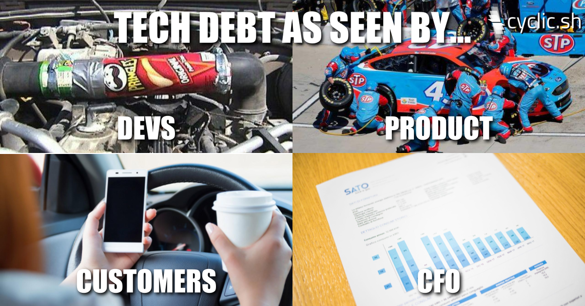

I have written previously about how we, as technical professionals, [misuse the term debt and end up sounding like idiots](/blog/2022-02-08-we-sound-like-idiots/index.md) in a business context. This is meant as a companion, to help better communicate, to our non-professional colleagues, what we mean when we say "technical debt".

‍<!-- truncate -->
As a software professional for almost 20 years (do I get a watch or plaque soon?) I've had more passionate discussions about technical debt than any other topic. It is right up there with the iconic 3rd rail topics: Tabs-v-Spaces, Mac-v-Windows, Java-v-Python and type systems.

From all these passionate discussions and online comments I have distilled a taxonomy of the dimensions of debt. All these types of debt at their core describe a trade off in time. Meaning they have a now vs later quality. What makes a reasoned discussion difficult is that they trade different quantities (mostly unmeasured) of different units across time with different potential probabilities of happening.

This is what a decision of technical debt could sound like applied to a non-software example. You take your car into the shop since the check engine light came on. The mechanic finds a slow leak in the radiator and offers you the following choices:

* do nothing, risking totaling the car if the engine over heats
* have it resolved in 15 mins for $25, by adding coolant, then $25 every month going forward, otherwise #badthingshappen
* have it patched by end of day for $150 but then be back in the same position if/when the patch fails
* have it replaced for $300 but your car will be in the shop for a week for parts to be ordered

#### So which is the best solution? Which do you pick?

Well, that is impossible to answer. There is no right answer.

In this example it depends on:

* your expected rate of some future events (how long will patch last? will leak get worse?)
* your need for the car to be working now (are you leaving on road trip vacation tomorrow?)
* your expected amount of future use of the car (are you planning to sell the car soon?)
* your bank account balance? (do you have any money?)
* your expected future cash flows (do you get paid next friday?)
* cost to borrow money (how much does your credit card charge?)

It is trivial to construct a scenario where the "obvious" choice would be any one of those options. The dimensions of the choice are:

* amount of money now vs later
* time till the car is working
* expected usage of the car in the future

Below is my attempt to at least describe and name the dimensions of technical debt akin to naming technical design patterns. If you think I missed a type or mischaracterized a type please tell me on twitter: [@seekayel](https://twitter.com/seekayel)

Dimensions of Debt
==================

Change time cost
----------------

Cost:

* Any future changes take more time.

  

How you will hear it described:

* If we want to make changes later we will first have to undue this work
* Next time we will first have to do x, y, z before we can make a change
* This will make unscheduled Project ABC that we want harder
* This is brittle and is more likely to break on the next change (increased error rate)
* On boarding/teaching new people is harder
* This is a tax on future changes

Financial Similarities:

* Bad credit score - all future borrowing will be more expensive
* Currency wide inflation/devaluation - all future consumption becomes more expensive (assuming you are on a fixed income)

Runtime cost
------------

Cost:

* Fixed cost in time per unit of time (eg 2hrs per week)
* Fixed cost in time per unit of system usage (eg 1hr per 1,000 user signups)

How you will hear it described:

* We have to spend X hours of support per week
* 20% of our staff hours works on escalations

Financial Translations:

* Interest only loan - will need to continue to pay until you pay off principle
* Selling/Buying insurance

Opportunity Cost
----------------

Cost:

* Whole sets of features aren't considered or built due to existing code/system/design

How you will hear it described:

* We don't build X or Y
* We don't measure/report on X or Y

Financial Similarities:

* Sunk cost fallacy
* Do you transition the same factory from producing lower value product to higher value product
* Career transition: forgo income, training/education expense, moving costs for future income

Interpretation:

This can be confused with the argument that actions aren't taken because the cost is too high. The focus here should be on the Opportunity that is missed. What could be but isn't, instead of the cost of what is.

Organizational Risk  
-------------------

Cost:

* The organization assumes: financial, reputational, operational or recruiting/retention risk.

How it is described:

* If X happens we will have to spend Y days scrambling to fix
* If it breaks we will have an outage
* If it breaks we will have a PR disaster/go out of business
* If it breaks we will be open to legal liability
* If it breaks we will have a security incident

Financial Similarities:

* Selling uncovered puts
* Selling uncovered calls
* Uninsured against fire/flood/earthquake
* Forgivable 0% interest only loan, but potential for demand payment

Interpretation:

This can be considered a compound dimension. It could include both the probability that the potential risk occurs along with the probable distribution of potential outcomes. For maximum clarity of communication I would suggest this dimension be discussed as the range of severity of the outcome, if the potential risk comes to pass.

Monetary Cost
-------------

Cost:

* The organization pays more money aka US Dollars ($) than is strictly necessary.

How it is described:

* The servers are too "big"
* The clusters aren't sized "right"
* We need to optimize process X for less memory
* We need to archive some/all of our data/logs
* We need to turn off things are aren't using

Financial Similarities:

* That gym membership that still is charged to your card each month even though you don't go.

Interpretation:

This is pretty straight forward, everyone in the organization understands dollars as a unit of cost. Where this is becomes more complicated is in the tradeoffs for any change with: how long it will take, what risk the organization assumes implementing it and the project coordination time to ensure one team's waste isn't another teams KPI.

Postscript  
----------

As a business person you will probably be more concerned about Opportunity Cost and Organizational Risk than Runtime Cost or Change Time Cost. What this means for developers is thinking how a particular project you would like prioritized maps to either Opportunity Cost or Organizational Risk is probably a more effective argument than the same for Runtime or Change time costs.
