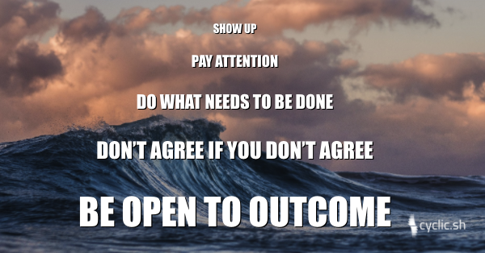

I was 16 and about to head off as the youngest member of a month-long wilderness sailing trip. The night before my departure my dad came into my room to check on my packing and inspect my gear. He got serious and gave me the following advice for how to stay alive, keep safe and make the most of my time.

It has stuck with me. It is the best, most concise advice I know for how to build a startup, be a parent or venture into the unknown.

<!-- truncate -->
  

### 1\. Show up

  

This is meant in all its forms and in its most expansive definition. Showing up is being physically present, mentally present and emotionally present. It means showing up with an attitude of engagement.

  

### 2\. Pay attention

  

So often our minds and our bodies live in two different places. Being present and paying attention to both the internal and external is shockingly hard. The people around us can tell when we are checked in or checked out mentally or emotionally. As a parent I've learned that kids are shockingly good at detecting emotional attention (or distraction ;).

  

### 3\. Do what needs to be done

  

This could mean carrying bags, cooking dinner, starting to sing to keep spirits up, offering help or asking for help. It is about identifying the need and doing it (or helping) regardless of "shoulds" or "jobs". Sometimes what needs to be done is letting someone struggle through a task they are learning. Being with them sometimes is what needs to be done. 

  
  

### 4\. Don’t agree if you don’t agree

  

In the context of the wilderness this meant if I wasn’t comfortable with the risks I needed to speak up. Sometimes keeping the group together is more important than the route that is taken. In those cases agree to keep the group together and disagree on the route. I've heard others describe this as "disagree then commit." This means taking a duty to fully express my opinion when we are discussing our plans. Then fully committing to making whichever plan we pick a success.

  
  

### 5\. Be open to outcome

  

This is the most philosophical. This is also the hardest for me. It is about not wasting energy on: worrying, fretting, anguish or anger. Still care passionately about what I am doing, that I should have strong preferences. Work hard to create those outcomes I desire. But let go of the belief that I am the only force in the world. This is about focusing on the process used to make a decision, and not the result.

  
  

Thanks dad ❤️
