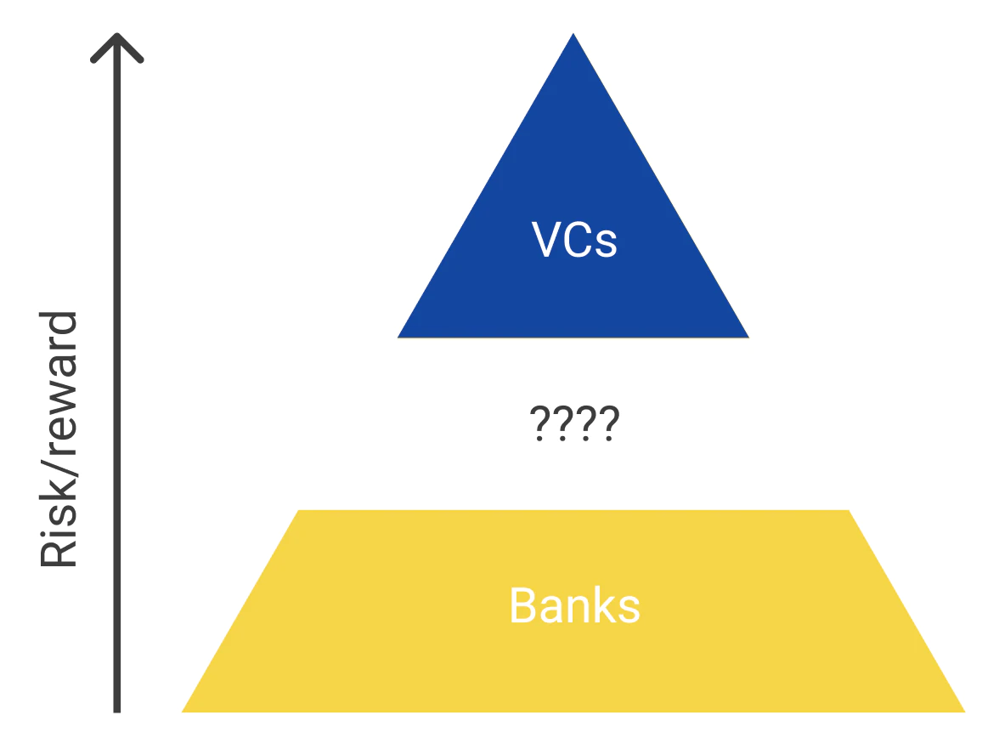
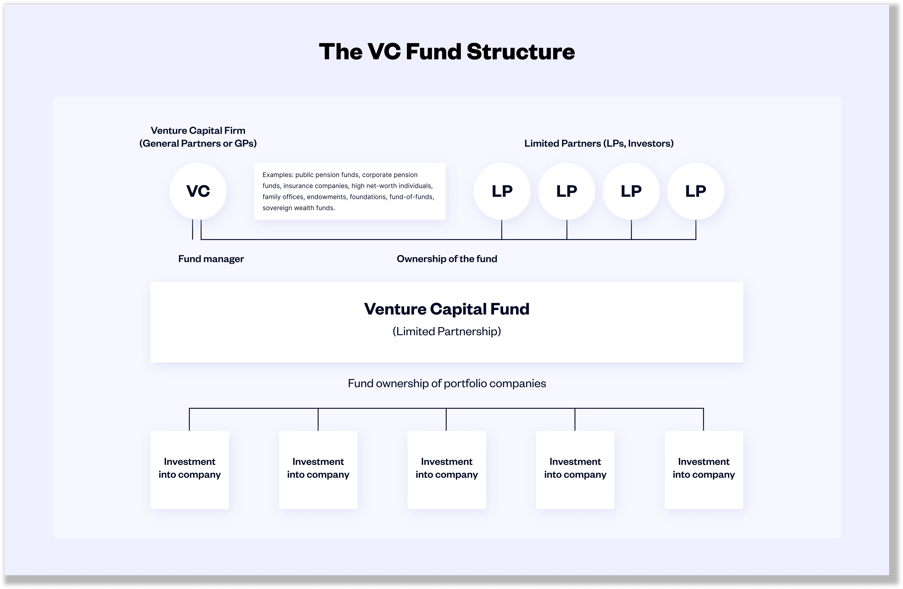
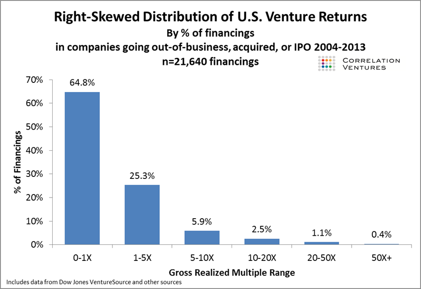

(photo credit [Charles Cushing](https://wonderstorms.substack.com/p/how-can-we-fix-the-market-for-solutions))  
  
This article is intended for startup founders, particularly for those who are first timers. There is nothing extraordinary about my VC experiences. I have done the following: raised an angel round and two institutional rounds (and failed at two rounds?) at a company I co-founded in the GovTech/Community space (SeeClickFix). I have participated in pitches as CTO of a pre-PMF (product market fit) mortgage tech company (HeavyWater). I have raised a friends-and-family round at my current Cloud Infrastructure company ([https://www.cyclic.sh](https://www.cyclic.sh))

‍<!-- truncate -->

The venture funding landscape is evolving. It seems there is more innovation now than at any other time. My goal here is to explain the general case so that you have a reference point for understanding the more novel or innovative approaches. Aka there are exceptions to everything here, but first let us learn the base case.

‍

The majority of the confusion or difficulty I had raising Venture Capital was that I didn’t fully understand the VC business model. I didn’t understand the individual investors and their incentives. I didn’t appreciate the incentives for the fund itself. Nor did I understand what the fund’s investors (Limited Partners aka LPs) were expecting. Hopefully this will help you understand what I didn’t.

‍

The VC business model
=====================

‍

Venture funds are companies. Their purpose for existence is to make money from making investments in other companies.

‍

They are composed of Limited Partners (LPs) and a General Partner (GP). The GP is the company owned and run by the "VC" you meet at some networking event. The VC has formed these companies and raised money from LPs. Part of the structure of the fund is that it will exist for no more than 10 years. At the end of that time all proceeds or investment holdings will be sent back to the LPs (minus any fees for the GP).

‍

VC Fund Structure (photo credit [Angel List](https://learn.angellist.com/articles/venture-capital-fund#toc_8_H2))

‍

‍

The LPs invest in the fund because they want to make money. The "Limited" in LP refers to the time the investor doesn’t spend working in the business. They send a check and that is their involvement.

‍

The VC formed the GP and raised money from the LPs because they want to make money. The GP charges a management fee of 2% per year on assets the LP invests with the fund.

‍

The GP will charge carry, aka 20% of any profits from the investments they make. The LPs get to first recover their initial investment, including those 2% fees, then any additional profits are shared with the GP.

‍

The Lifecycle of a single VC fund
=================================

‍

Just as VC funds have standard structures and standard fees, they have a standard development and lifecycle. Understanding where a particular fund is in this progression will help you understand their expected behavior. Also, a single VC might have multiple funds that are in different stages of this trajectory. I have found that VCs are very open and willing to talk about which fund they are actively investing out of, how big it is, when they raised it and their average check size. I have always been able to find this information by asking.

‍

First Years: Load up the Plate
------------------------------

‍

As a new entrepreneur I didn't realize how critical time fit with a VC was. After they raise from their investors (LPs) they are on a time crunch to get the money invested. They want to invest in good companies but they only have about 1-3 years to invest. This means it is much easier to raise from a VC who has just raised. They are rapidly putting money to work. They just arrived at the buffet with an empty plate. Everything looks good and they don't have anything that is a better alternative already on their plate.

‍

Middle Years: Getting Picky
---------------------------

‍

After that first phase they transition into a slower but still active investment role. In this 4-6 year middle window a VC will still take meetings but are much less likely to make new investments. At this phase they have a full plate but are still wandering around the buffet looking for great options. The threshold is now higher for inclusion. They may prefer the truffle parm fries they just found (your company), but they already have cajun curly fries which are almost as good (a company they already invested in). However they may have raised a new fund so they could be in two phases at once - make sure to ask!

‍

These VCs won't tell you that they probably won't invest. They are happy to ask questions and probe into your business. They get tremendous market intelligence from taking these meetings. They get to see:

* What people are pitching (deal flow)

* How is the market is responding to these pitches?

* Do you raise quickly? Do you struggle to raise? At what price? On what terms?

* Benchmark strategy data for their current portfolio companies eg Are social ads working? What is your customer acquisition cost? What are your churn rates?

* Potential insights for their current portfolio companies

* Optionality of investing in an amazing company/founder eg maybe your company is the best investment they have seen in their professional life

‍

Final Years the Tail End: Finishing up
--------------------------------------

‍

At this point they have transitioned to harvesting or running off the portfolio. They are returning funds to investors. They know that their investment fund will close after 7-10 years so this is a period of actively winding down.

‍

At the buffet they have switched to dessert and coffee. It would be an extraordinary turn of events such that you could convince them to take a scoop of some new main course. More likely they have raised another fund, probably at the end of the first year or two and any pitch would get investment from that fund. So effectively that VC is "loading their plate" even if one of their funds is in this phase of winding down.

‍

Outcome Fit
===========

‍

A natural tendency when considering an endeavor (business or other) is to start with the likelihood of success. This line of thinking asks how probable each outcome is. It is a frame of thinking that trades size of outcome for certainty in outcome. Increasing certainty can raise the floor on returns, but also lower the ceiling.

‍

When the VC was raising money from LPs they put together a spreadsheet that described the basic economics of the venture fund. Roughly it modeled the following for 10 investments:

* 5 will fail completely, the investments will be a complete loss

* 3 will do ok, they will each return somewhere between 3x

* 1 will do great, it will return 10x

* 1 will do amazing, it will return 25x+

‍

This would put the fund in the top-1% of VCs. A more likely outcome of those 10 investments is:

* 6 will fail
* 3 will do ok they will each return on average ~3x
* 1 will do great, it will return ~5x

‍

This would put the VC roughly at the median returns for all VC firms. You can read more over at this [great break down of VC returns](https://www.toptal.com/finance/venture-capital-consultants/venture-capital-portfolio-strategy#strike-outs-dont-matter-in-vc).

‍

Distribution of Returns on VC Investments (credit: [Seth Levine](https://www.sethlevine.com/archives/2014/08/venture-outcomes-are-even-more-skewed-than-you-think.html))

‍

Let us step back and look at your company from the VC's perspective for a moment. They are evaluating if your company has the potential of returning 10-50x the investment they make. Only if the company passes that screen will they engage on if your company has a reasonable risk adjusted chance of making that outcome a reality.

‍

Conclusion
==========

‍

The tech twitter joke of "big if true" can be a helpful tldr guide for how VCs evaluate potential investments. Make sure you know where they are in their investing lifecycle to ensure you are spending your time wisely. Hopefully this was helpful. If you have any questions or if I wasn’t completely clear find me on twitter: [@seekayel](https://twitter.com/seekayel)

‍
