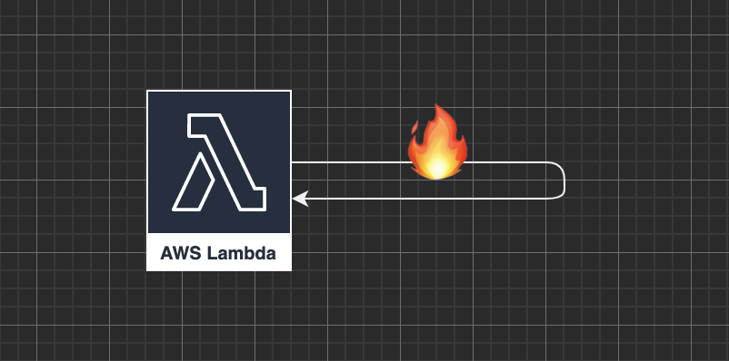

This blog series is an extended version of a talk I gave at [Serverless Days NYC 2022](https://nyc.serverlessdays.io/). The goal is to share ways that a "friend of mine" has failed at serverless to help level up the community. Just as the transportation industry shares accident report analysis with the whole industry to improve safety, we in the software community need to do the same. This is my attempt to do that.

I'm sure there is some product X that has feature Y that fixes issue Z. I either didn't know about it at the time, didn't have the budget, couldn't get it through vendor/security review, product wouldn’t schedule it with our engineers or it didn't comply with enterprise architecture's plan for our software roadmap. As some guy once said: “You go to production with the tools you have, not the tools you want.”

Note:

- Names have been changed to protect the innocent and not so innocent.
- Only egos (and wallets) were harmed by the failures recounted here.

## Serverless is Stateless

All the architecture posts talk about serverless as stateless computing. How serverless is so scalable because it scales out to satisfy increased load, and scales in when not needed. This all makes sense. Lambda is like a big thread pool in the sky. Got it.

I can set some parameters to manage the maximum and minimum number of threads and AWS would handle all the hard work of hosting, spinning up, spinning down and networking the instances together. Awesome-sauce.

Well, almost...

## Use Case

Background job that receives batches (10's-100's) of PDFs from the client, splits them apart into individual pages (1-1000 per PDF) and does analysis on each page. The arrival rate from the client is lumpy. Primarily US working hours on a 5 min interval. Response is measured in hours. This feels like a perfect HelloWorld use case for StepFunctions doing orchestration and Lambda doing image manipulation.

Lambda logic:

- Invoke with S3 path to file
- Read 10+mb files from S3 to /tmp
- Process file
- Write results to S3
- Respond with S3 path to transformed file
- Serverless FTW!

Everything works great until... inconsistent out of disk space errors, or no space left on device (depending on your OS/language stack).

## How to Fail

### Problem

Periodically a step function run will fail due to a Lambda invoke failing on no space left on device (or similar depending on os and language). Running the same file in dev/test doesn't reproduce the error. Re-running the step function in production succeeds.

### Solution

Well lambda instances have a writable `/tmp` folder where you can store temporary files. And somewhere in the AWS docs they describe how instances of your Lambda function are reused between invocations.

Some quick googling gets you a solution of clearing `/tmp` at the start and/or end of each invocation [(stackoverflow ftw)](https://stackoverflow.com/questions/44108712/aws-lambda-release-tmp-storage-after-each-execution). Till that fix makes it to production you can just re-execute any failed step function runs.

Nothing quite like shipping code copy-pasted from Stack Overflow. Nice.

Success! Party!

until... wait what? out of memory errors? WTF!

### Problem v2

Periodically a step function run fails. The Lambda invoke error is no memory left (or similar depending on os and language). Running the same file in dev/test doesn't reproduce the error. Re-running the step function in production succeeds. Turning on debug or releasing new builds adding additional logging suppress the error rate. WTF (why the failure?) Load tests don't reproduce the error.

The explanation that AWS just fails on 1 in ~100k lambda invokes starts to wear thin with your Ops team that is getting paged to click a button. But we could just automate the re-run!

Deep inside accepting it "just fails" violates some axiom about how computers works. This is knowable and damn-it I shall know. So you strap the lambda down setting max concurrency to 1. Turn up the load test. Let’s do this.

At 12k documents the lambda invoke fails for out of memory. Interesting.

Rerun the load test. At 12k documents the lambda invoke fails for out of memory.

If an error is repeatable it isn't random. 12k is an important number. It also happens to be the maximum number of file descriptors allowed for the linux OS the lambda is running on.

Back to google. Apparently the image manipulation library I am using has a history of bugs with leaving open file descriptors. Looks like each invoke to lambda is leaving another file descriptor open in the OS file descriptor table.

The lambda will then fail when it hits 12k unless it is recycled. The lambda instance can be recycled due to:
- a code deployment: new code, new instances
- update to environment variable: hence why turning on debugging suppressed errors.
- scaling down: a burst in load will scale out new instances and then scale back down. Only some instances survive.

### Solution v2

Expand the IAM role permissions to allow the lambda permission to update itself (your security team might give you side eye for this, fair warning, send them this blog post, I'm sure it will convince them).

After completing the work of an invoke, call the lambda api to set an environment variable to a random value. We dubbed this the "self-immolation" solution.

Hacky? Yeah.

Chaos for the lambda team? Probably.

Did it work? Yes.

Stay tuned, for more stories of #fail.
