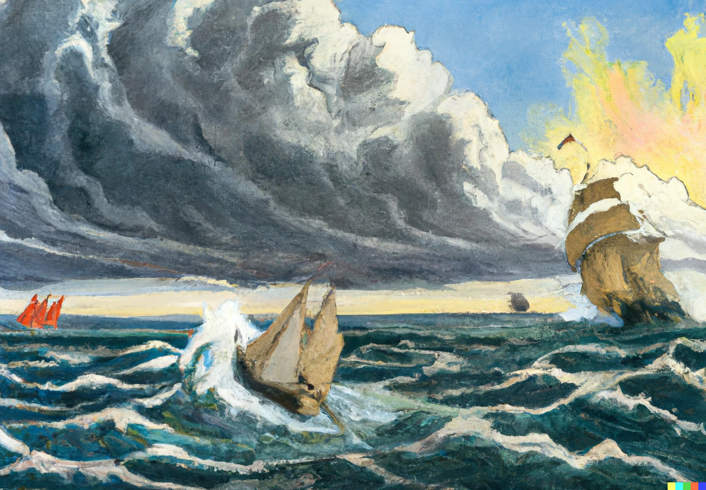

# Tis The Set Of The Sail or One Ship Sails East

by [Ella Wheeler Wilcox](https://en.wikipedia.org/wiki/Ella_Wheeler_Wilcox)

<!-- truncate -->

 
But to every mind there openeth, 
A way, and way, and away, 
A high soul climbs the highway, 
And the low soul gropes the low, 
And in between on the misty flats, 
The rest drift to and fro. 
 
But to every man there openeth, 
A high way and a low, 
And every mind decideth, 
The way his soul shall go. 
 
One ship sails East, 
And another West, 
By the self-same winds that blow, 
'Tis the set of the sails 
And not the gales, 
That tells the way we go. 
 
Like the winds of the sea 
Are the waves of time, 
As we journey along through life, 
'Tis the set of the soul, 
That determines the goal, 
And not the calm or the strife. 
 
