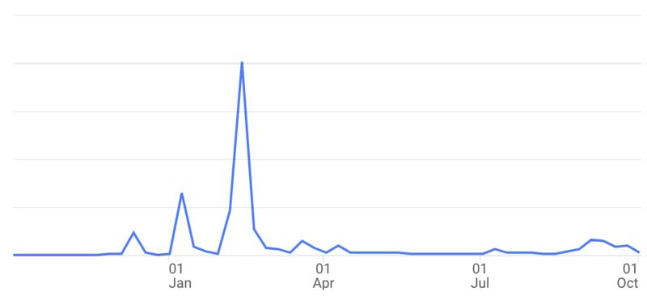
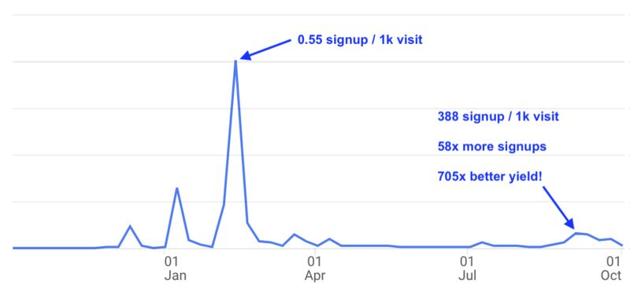

Chasing the wrong KPI is like chasing a mirage of water in the desert. 
 
Check out our trailing twelve month site analytics above. 

Our marketing and user acquisition was awesome in Feb, right? More of that? 
 
<!-- truncate --> 
 
Well if our KPI was visits or visitors, sure. But is that the right KPI? 
 
If you add the context of user signups you see a totally different picture. 
 

 
We got 58x more user signups and were 705x better at converting. 
 
This was due to multiple improvements. The biggest was the intent of visitors. We found a much smaller group of people with a much higher desire for what we offer. 
 
Optimizing for things that don't matter is the easiest way to fool yourself that you are doing something productive.