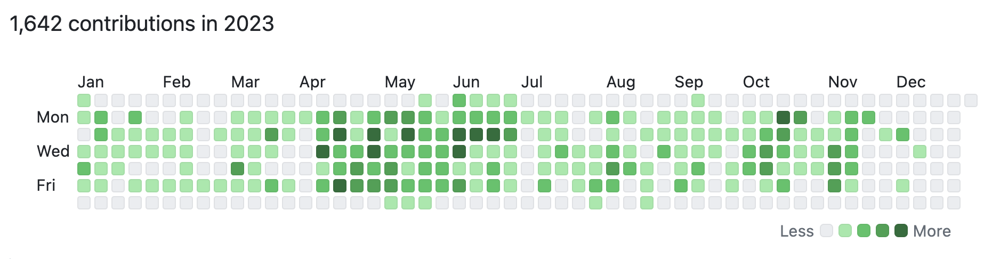

<!-- truncate -->

## Timeline

- Q1: Fundraising
- Q2: Deep technical work
- Q3: Pricing, Customer Growth
- Q4: Scrambling to find a survival path

## What worked

- Pushed hard on coding and delivering value for users/customer.
- Rebuilt infrastructure in Rust using ChatGPT and strong testing harness.

## What didn't work

- Failed to fundraise for Cyclic