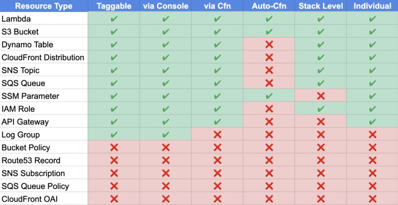

AWS is incredibly powerful. Their products are awesome. Their ability to execute is unparallelled.

Their ability to fumble the ball so completely in some areas is also breath taking. Tagging is one of those features.

<!-- truncate -->

The concept is simple, each resource can have user defined keys and values applied to them. These values are then available whereever meta data about those resouces are available. These include:
- IAM policies (ABAC: Attribute Based Access Control)
- billing / usage reports
- API calls
- AWS Console

These tags get created through:
- Console
- API
- CLI
- CloudFormation

The problem is that none of these methods is consistent.

CloudFormation documentation states that it automatically applies three standard tags derived from the stack all all created resources. 
- aws:cloudformation:stack-name
- aws:cloudformation:stack-id
- aws:cloudformation:logical-id

However it only has a 50% hit rate in the serverless resources tested.

The docs also state that it will cascade down any tags applied to the stack to any generated resources. Again only 50% hit rate.

Inside of cfn syntax each resource seems to have a different syntax. CFN validate doesn't catch these problems.

What gives?